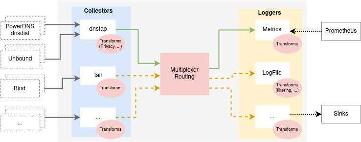

# go-dnscollector

`go-dnscollector` acts as a high speed passive analyser for DNS traffic written in Go.

Features:
- Collectors 
    - [Dnstap](https://dnstap.info/) Streams
        * tcp or unix socket listener
        * tls support
    - DNS packets sniffer
        * IPv4, IPv6 support (fragmented packet ignored)
        * UDP and TCP transport
        * BFP filtering
    - Tail 
        * Read DNS events from the tail of text files
        * Regex support
- Loggers
    - Stdout
        * supported format: text, json
        * custom text format
    - Text files
        * with rotation file support
        * supported format: text, json
        * gzip compression
        * execute external command after each rotation
        * custom text format
    - [Dnstap](https://dnstap.info/) stream client
        * to remote tcp destination or unix socket with tls support
    - Raw TCP client
        * to remote tcp destination or unix socket with tls support
        * supported format: text, json
        * custom text format
    - [Rest API](https://generator.swagger.io/?url=https://raw.githubusercontent.com/dmachard/go-dnscollector/main/doc/swagger.yml) 
        * prometheus metrics format
        * qps, total queries/replies, top domains, clients, rcodes...
        * basic auth
        * tls support
    - [Syslog](https://en.wikipedia.org/wiki/Syslog) server
        * local or remote one
        * custom text format
    - [Fluentd](https://www.fluentd.org/) client
        * to remote fluentd collector or unix socket with tls support
        * [msgpask](https://msgpack.org/)
    - [Pcap](https://en.wikipedia.org/wiki/Pcap) files
        * with rotation file support
        * binary format
        * gzip compression
        * execute external command after each rotation
- GeoIP support (Country code)
- Packet filtering (regex support)
- Query IP-Addresses anonymizer

For more informations about **dnstap**, please to read the following page [Dnstap: How to enable it on main dns servers](https://dmachard.github.io/posts/0001-dnstap-testing/)



## Installation

**Run-it from binary**

Download the binary from release page.
If you want to integrate this tool with systemd, please to follow this [tutorial](https://gist.github.com/dmachard/413ee77099046c2b1779737909e1b017).

```go
./go-dnscollector -config config.yml
```

**Run-it from dockerhub**

Use the default config (dnstap -> stdout + rest api):

```bash
docker run -d --rm --network host dmachard/go-dnscollector
```

Override the default configuration (/etc/dnscollector/config.yml) with a config file on the host and custom ports:

```bash
docker run -d -p 6000:6000 -p 8080:8080 -v $(pwd)/config.yml:/etc/dnscollector/config.yml dmachard/go-dnscollector
```

## Configuration

A typically configuration would have one or more collector to receive DNS traffic or logs, and severals loggers to process the 
incoming traffics. See [Configuration guide](doc/configuration.md).

## Use-cases

### Use case 1: collect dnstap stream and backup-it to log files

With this example the collector waits incoming dnstap messages sent by dns server and backup-it in log files

The full config file for this use-case can be found [here](example-config/use-case-1.yml)

### Use case 2: collect dnstap stream and get statistics usage (dnscollector>prometheus>grafana)

With this example the collector waits incoming dnstap messages sent by your dns server, then you 
can watch statistics and metrics on your Grafana dashboard.

The full config file for this use-case can be found [here](example-config/use-case-2.yml).

The dashboard can be found [here](example-config/grafana-dashboard.json).

## Benchmark

Tested on the following machine: 8 vCPUs, 32 GB memory

| packet per sec received| DnsCollector |
| ---- | ---- | 
| 50k   | OK - 0% lost| 
| 100k   | OK - 0% lost| 
| 150k   | OK (0.07% lost)|

## For developers

Run from source 

```
go run .
```

Execute testunits for collectors

```
go test -timeout 10s ./collectors/ -cover -v
```

Execute testunits for loggers

```
go test -timeout 10s ./loggers/ -cover -v
```

Execute testunits for subprocessors

```
go test -timeout 10s ./subprocessors/ -cover -v
```

Execute a test for one specific testcase in a package

```
go test -timeout 10s -cover -v ./loggers -run TestSyslogRunJsonMode
```

Build executable

```
CGO_ENABLED=0 GOOS=linux GOARCH=amd64 go build -o go-dnscollector *.go
```
